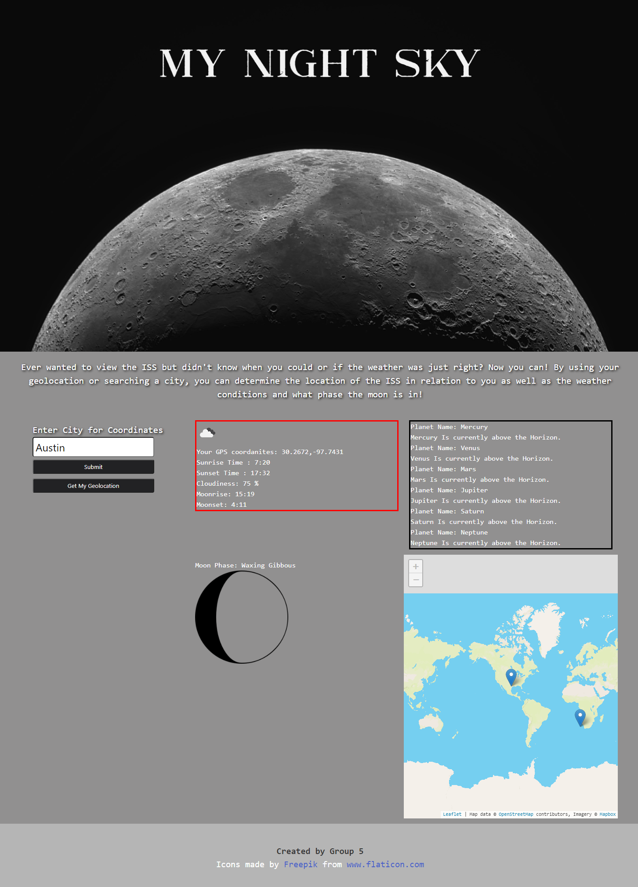

# My Night Sky

### ScreenShot

## Purpose

AS AN astronomy student
I WANT to know the viewing conditions when the sun goes down
SO THAT I can determine what I can see in the sky

## Built With

* HTML
* CSS
    - [Bulma](https://bulma.io/)
* Javascript 

## API Reference

* [OpenWeather](https://openweathermap.org/api)
* [Where the ISS at?](https://wheretheiss.at/w/developer)

## Image Reference

* [Moon- in header](https://negativespace.co/)
* [Moon phases](www.flaticon.com)
* [Map- Leaflet](https://leafletjs.com/)

## Website

https://coevpen.github.io/my-night-sky/

## Contribution

Made with ❤️ by John Pacini, Courtney Evins, Chris Tijerina, and Adam Castro

### My Night Sky Inc. 

